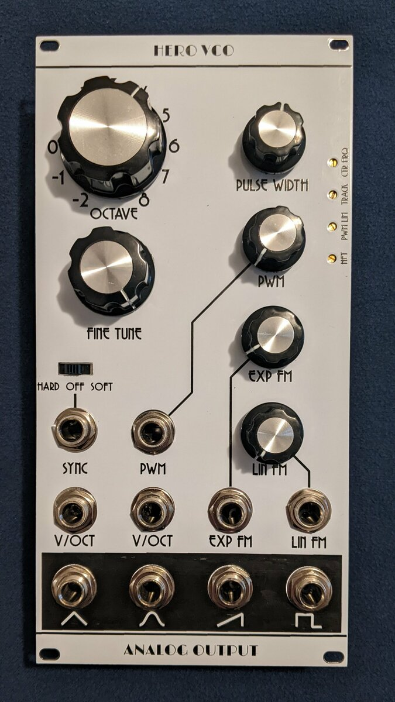
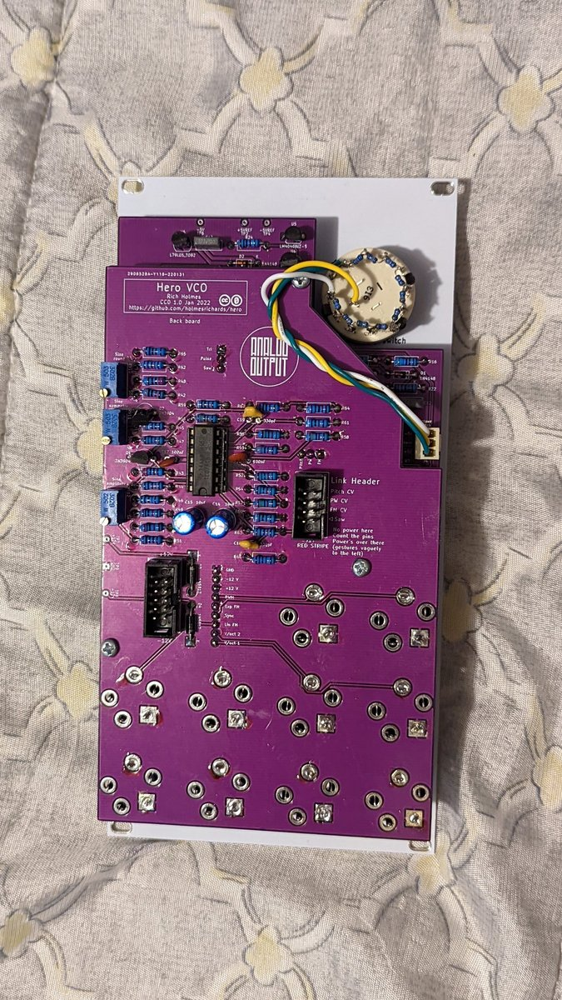

# Hero VCO

The Hero VCO is a 3340 based voltage controlled oscillator synth module in Kosmo format. Notable features of the Hero include:

* Triangle, ramp, pulse, and sine waveforms with separate output jacks.
* Uniform, zero-centered ±5 Vpp output amplitudes for the various wave shapes.
* Input jacks for two V/oct CVs, as well as PWM, linear FM, and exponential FM (pitch) CVs with attenuators.
* Separate initial pulse width and PWM attenuator knobs.
* Wide pulse width range.
* Switch selectable hard, soft, or no sync.
* 11 position octave switch plus fine tuning knob.
* Front panel access to trimmers for calibration of V/oct tracking, center pitch, and pulse width range limit.
* Entirely through hole construction with readily available components.

Two well known problems with the 3340 in its datasheet configuration are addressed:

* Regulated -5 V supply improves stability and suppresses pulse width frequency shift.
* Falling edge oscillations on pulse wave shape are eliminated.

But perhaps the most significant feature of the design is the link header. This may be used to connect the Hero to one or more of its sister module, the [Sidekick VCO](https://github.com/holmesrichards/sidekickvco), in a modern riff on the classic Moog 921a/921b system. The Sidekick is half the width of the Hero and lacks some of the Hero's front panel controls and inputs, but internally is essentially the same circuit as the Hero. Via the link, the Sidekicks receive summed V/oct pitch CV, linear FM CV, and pulse width CV from the Hero, based on its front panel controls and inputs. In this way a common set of control voltages is presented to the Hero and all its Sidekicks. The link also permits the Sidekicks to be hard or soft synced to the Hero. This allows easy configuration of a multi-oscillator synth voice in a relatively compact system.

The Hero design specifies and assumes the Alfa AS3340A VCO chip, an improvement to the AS3340, although the AS3340 or Curtis CEM3340 probably would work. (See build notes.)

Thanks for inspiration to several other VCOs: the [Kassutronics VCO 3340](https://kassu2000.blogspot.com/2018/06/vco-3340.html), the [LMNC 1222 Performance VCO](https://www.lookmumnocomputer.com/1222-performance-vco), and the [Thomas Henry VCO Maximus](https://www.birthofasynth.com/Thomas_Henry/Pages/VCO_Maximus-Detail.html).

## Project status

One prototype (v. 0.91) has been built and it works. There were some minor issues identified:


- L79L05 footprint does not have wide leg spacing.
- Jack footprints are round holes instead of slots.
- 330pF cap footprint is 2.5 mm pitch, should be 5 mm.
- Resistors specified for octave switch are 100k, 10k would be (arguably) better.
- No indication on silkscreen for which resistors to match.
- Some silkscreen refs obscured by pads.
- Resistors between trimmers make assembly awkward, move to other side of board.
- Slide switch footprint incorrect, requires cutting off mounting legs.

See build notes for mitigations. These issues have been corrected in the design files but the revised version has not been tested. 

## Width

10 cm.

## Current draw
33 mA +12 V, 34 mA -12 V.


## Photos




## Documentation

* [Schematic](Docs/herovco.pdf)
* PCB layout: [front](Docs/herovco_layout_front.pdf), [back](Docs/herovco_layout_back.pdf)
* [BOM](Docs/herovco_bom.md)
* [Build notes](Docs/build.md)
* [How it works](Docs/howitworks.md)
* [Blog post](https://analogoutputblog.wordpress.com/2022/06/20/hero-and-sidekick/)

## GitHub repository

* [https://github.com/holmesrichards/herovco](https://github.com/holmesrichards/herovco)

## Submodules

This repo uses submodules aoKicad and Kosmo_panel, which provide needed libaries for KiCad. To clone:

```
git clone git@github.com:holmesrichards/herovco.git
git submodule init
git submodule update
```


Alternatively do

```
git clone --recurse-submodules git@github.com:holmesrichards/herovco.git
```

Or if you download the repository as a zip file, you must also click on the "aoKicad" and "Kosmo\_panel" links on the GitHub page (they'll have "@ something" after them) and download them as separate zip files which you can unzip into this repo's aoKicad and Kosmo\_panel directories.

If desired, copy the files from aoKicad and Kosmo\_panel to wherever you prefer (your KiCad user library directory, for instance, if you have one). Then in KiCad, go into Edit Symbols and add symbol libraries 

```
aoKicad/ao_symbols
Kosmo_panel/Kosmo
```
and go into Edit Footprints and add footprint libraries 
```
aoKicad/ao_tht
Kosmo_panel/Kosmo_panel.
```
